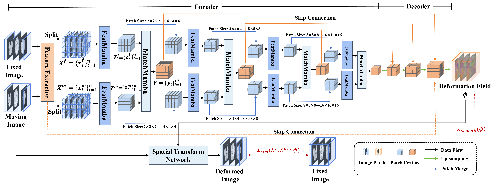
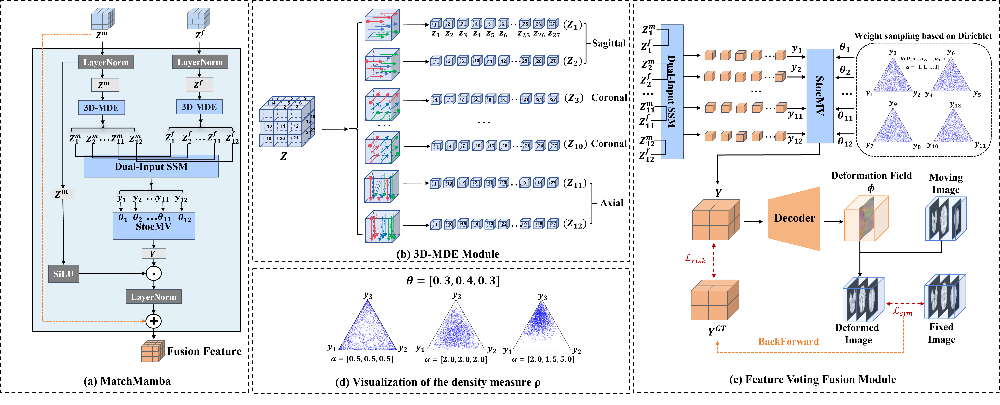
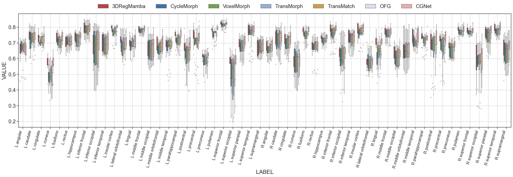
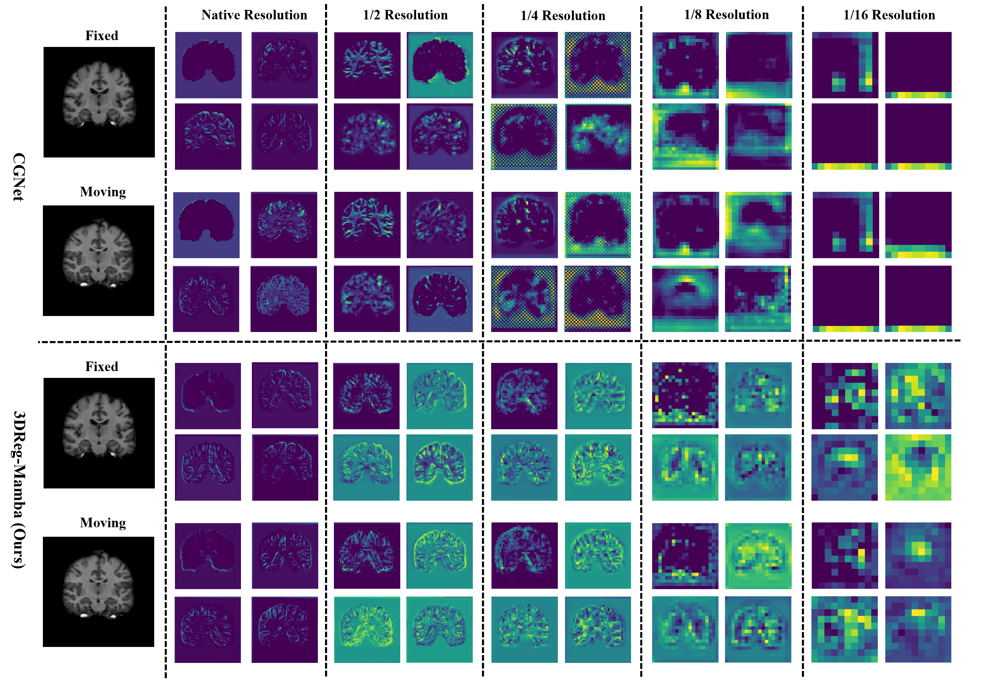

# 3DReg-Mamba

A novel dual-stream framework, 3DReg-Mamba, based on the Mamba model, treats 3D registration as a state-space modeling (SSM) problem capturing global dependencies in linear complexity. The framework consists of two core modules: FeatMamba for extracting global structural features with long-range dependencies, and MatchMamba for matching features between pairs of images by recursively integrating the global contexts of the two images, thus avoiding computationally costly block-by-block matching. In addition, the MatchMamba module employs a multidirectional coding strategy (including axial, coronal and sagittal flattening) and a feature voting fusion mechanism to enhance robustness and generality.

## Overall Architecture



**Modules Architecture Diagram**



## Usage

This repository currently provides examples of implementing, training, and inferring with the core model code. It also includes guidance on running the code on sample datasets. 

### Environment

We implement the code on `python 3.10.13`, `pytorch 2.1.1`, and `simpleitk 2.4.0`.

In particular, install the following two packages to ensure that Mamba will run successfully:

`causal_conv1d==1.1.3.post1`, `mamba_ssm==1.1.1`

### Dataset

- LPBA40 
- IXI 
- OASIS 
- AbdomenCT-CT
- SR-Reg

### Train and Infer Command

Before running the commands, please ensure that the dataset has been correctly placed. Taking the example of running the sample code on the LPBA40 dataset, ensure that the LPBA40 dataset is placed under `../Dataset/LPBA40_delineation/`. This will ensure that the code can run directly without encountering any path-related errors. (Here, `./` refers to the directory path where `Train_LPBA40.py` and `Infer_LPBA40.py` are located.)

**The model weight file for the LPBA40 dataset is stored in the `./Checkpoint/LPBA40/V2/final.pth.tar` directory.**

**The inference results are stored in the `./Result/LPBA40/V2/`  directory.**

For Linux:

Train:

```
export CUDA_VISIBLE_DEVICES=0 (If needed)
python Train_LPBA40.py
```

Infer:

```
export CUDA_VISIBLE_DEVICES=0 (If needed)
python Infer_LPBA40.py
```

The settings for each parameter of the code are located in `./utils/config.py`

## Example Results

**Visual results obtained by applying each alignment method for registration on the IXI dataset**


**Box plots show the Dice scores on 54 anatomical structures on the LPBA40 dataset using CycleMorph, VoxelMorph, TransMorph, TransMatch, OFG, CGNet, and our proposed method 3DRegMamba**




**Qualitative comparison of intermediate hierarchical features extracted by CGNet and our proposed 3DReg-Mamba**





## Acknowledgments

We compared 3DReg-Mamba with **eight** baseline registration methods . The links will take you to their official repositories.

- SyN/ANTsPy
- NiftyReg
- VoxelMorph
- CycleMorph
- TransMorph
- TransMatch
- OFG
- CGNet

We sincerely acknowledge this projects.


